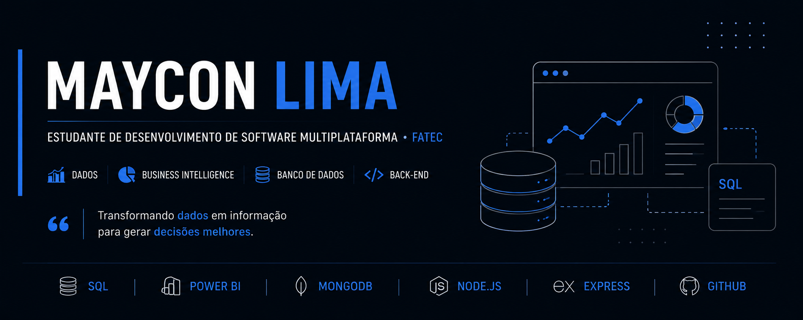
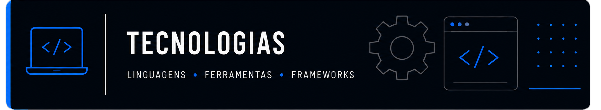
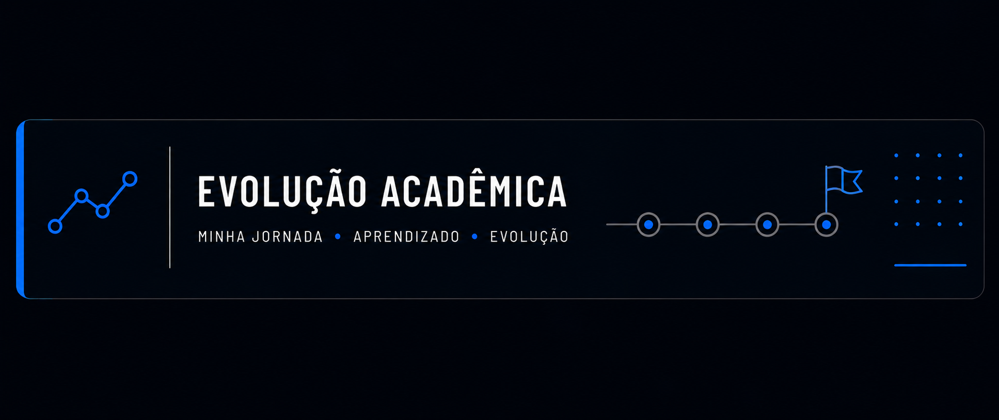
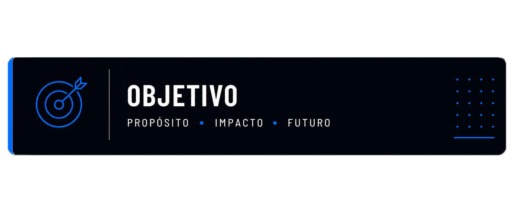

<div align="center">



<br/>

[](https://www.linkedin.com/in/maycon-lima-5a4b772bb/)
[](mailto:mayconlima2006@gmail.com)
[](https://github.com/piruetai)


</div>

<br/>


Sou o **Maycon**, estudante de **Desenvolvimento de Software Multiplataforma na FATEC Zona Sul**, com foco de carreira voltado para a área de **Dados**.

Curto entender como a informação se move dentro de um sistema: da modelagem do banco de dados até a regra de negócio que decide o que fazer com ela, e finalmente até o dashboard que transforma tudo isso em decisão. É essa ponte entre **dado bruto** e **informação útil** que mais me interessa desenvolver.

- 🔎 Foco atual: **bancos de dados relacionais e não relacionais**, **modelagem de dados**, **regras de negócio** e **Business Intelligence**;
- 🧩 Gosto de atuar próximo da estrutura dos sistemas: modelagem, consistência dos dados e arquitetura (MVC);
- 🤝 Já participei de projetos em equipe, atuando principalmente na camada de dados e na validação das regras operacionais;
- 🌱 Atualmente **apenas estudando**, mas de olho em oportunidades na área de dados.

<br/>



<div align="center">

**Bancos de Dados**


**Business Intelligence**


**Linguagens & Desenvolvimento**


**Ferramentas**


</div>

<br/>

## 📁 Projetos em Destaque

<table>
<tr>
<td width="50%" valign="top">

### 🦁 Studio Patty Leão

Sistema operacional (ERP simples) para um salão de beleza, com agendamentos, estoque, financeiro manual, vitrine de reservas e BI. Projeto acadêmico extensionista da FATEC Zona Sul.

**Minha atuação:** modelagem e validação do banco de dados (MongoDB), análise e validação das regras de negócio, participação na arquitetura MVC e revisão crítica da consistência dos dados e dos fluxos do sistema.

`Node.js` `Express` `MongoDB Atlas` `MVC`

[](https://github.com/piruetai/Studio_Patty_Leao)

</td>
<td width="50%" valign="top">

### 🎓 InteliBolsas

Plataforma web para divulgação de bolsas de estudo e cursos, conectando instituições de ensino a alunos, com áreas exclusivas para alunos, instituições e administradores.

**Minha atuação:** modelagem de dados, desenvolvimento de CRUD e definição da estrutura geral do projeto.

`PHP` `MySQL` `CRUD`

[](https://github.com/piruetai/InteliBolsas)

</td>
</tr>
</table>

<br/>



```
🎓 FATEC Zona Sul
   Desenvolvimento de Software Multiplataforma

   ├── Fundamentos de lógica e banco de dados relacional
   ├── Modelagem de dados e regras de negócio em projetos reais
   ├── Introdução a bancos não relacionais (MongoDB)
   └── Aprofundamento em Business Intelligence (Power BI)
```

### 📚 Atualmente estudando

- 🗄️ Aprofundamento em **modelagem de dados** relacional e não relacional;
- 📊 **Power BI** — construção de dashboards e storytelling com dados;
- 🧠 Boas práticas de **regras de negócio** e arquitetura de sistemas orientados a dados.

<br/>



Meu objetivo é **crescer como profissional de dados**, aprofundando meus conhecimentos em **banco de dados relacional e não relacional**, **regras de negócio** e **Business Intelligence**, sempre desenvolvendo isso em **equipe** e em **projetos reais** — que é onde, na prática, os dados realmente viram decisão.

> *"Transformando dados em informação para gerar decisões melhores."*

<br/>

<div align="center">

### 📬 Vamos conversar?

[](https://www.linkedin.com/in/maycon-lima-5a4b772bb/)
[](mailto:mayconlima2006@gmail.com)

<sub>Obrigado pela visita! ⭐ Sinta-se à vontade para explorar meus repositórios.</sub>

</div>
